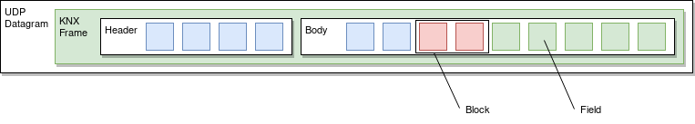
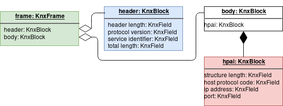

KNX
===

KNX is a field bus protocol, mainly used for building management systems. BOF
implements KNXnet/IP, which is part of the KNX specification to link field KNX
components to the IP network.

.. code-block::

   from bof import knx

Discover KNX devices
--------------------

The function `search()` from `bof.knx` lists the IP addresses of KNX devices
responding on an IP network.

>>> from bof import knx
>>> knx.search("192.168.1.0/24")
['192.168.1.10']

The function `discover()` gathers information about a KNX device at a defined IP
address (or on multiple KNX devices on an address range) and stores it to a
``KnxDevice`` object.

>>> from bof import knx
>>> device = knx.discover("192.168.1.10")
>>> print(device)
KnxDevice: Name=boiboite, MAC=00:00:54:ff:ff:ff, IP=192.168.1.10:3671 KNX=15.15.255

Connect to a device
-------------------

.. code-block:: python

   from bof import knx, BOFNetworkError

   knxnet = knx.KnxNet()
   try:
       knxnet.connect("192.168.1.1", 3671)
       # Do stuff
   except BOFNetworkError as bne:
       print(str(bne))
   finally:
       knxnet.disconnect()

The class ``KnxNet`` is used to connect to a KNX device (server or object). It
creates a UDP connection to a KNX device. ``connect`` can take an additionnal
``init`` parameter. When ``True``, a special connection request frame is sent to
the remote KNX device to agree on terms for the connection and "initializes" the
KNX exchange. This is required for some exchanges (ex: configuration requests),
but most requests can be sent without such initialization.

Send and receive frames
-----------------------

.. code-block:: python

   frame = knx.KnxFrame(type="DESCRIPTION REQUEST")
   print(frame)
   knxnet.send(frame)
   response = knxnet.receive()
   print(response)

When a connection is established, one may start sending KNX frames to the
device. Frames are sent and received as bytes arrays, but they are represented
as ``KnxFrame`` objects within BOF. In the example below, we create a frame with
type ``DESCRIPTION REQUEST`` (asking the device to describe itself). The format
of such frame is extracted from BOF's KNX specification JSON file (see next
section for details). The object is converted to a byte array when sent to the
device. The ``response`` received is a byte array parsed into a ``KnxFrame``
object.

There are several ways to gather information about a created or received frame:

.. code-block:: python

   >>> bytes(frame)
   b'\x06\x10\x02\x03\x00\x0e\x08\x01\x7f\x00\x00\x01\xbe\x6d'

   >>> print(frame) 
   KnxFrame object: <bof.knx.knxframe.KnxFrame object at 0x7fb810f799b0>
   [HEADER]
       <header length: b'\x06' (1B)>
       <protocol version: b'\x10' (1B)>
       <service identifier: b'\x02\x03' (2B)>
       <total length: b'\x00\x0e' (2B)>
   [BODY]
       KnxBlock: control endpoint
           <structure length: b'\x08' (1B)>
           <host protocol code: b'\x01' (1B)>
           <ip address: b'\x00\x00\x00\x00' (4B)>
           <port: b'\x00\x00' (2B)>

   >>> print(frame.sid)
   DESCRIPTION REQUEST

   >>> print(frame.attributes)
   ['header_length', 'protocol_version', 'service_identifier', 'total_length',
   'control_endpoint', 'structure_length', 'host_protocol_code', 'ip_address',
   'port']

The content of a frame is a set of blocks and fields. The ordered list of fields
object (even fields in blocks and blocks within blocks) can be accessed as
follows:

.. code-block:: python

   >>> for field in frame:
   ...     print(field)
   ... 
   <header length: b'\x06' (1B)>
   <protocol version: b'\x10' (1B)>
   <service identifier: b'\x02\x03' (2B)>
   <total length: b'\x00\x0e' (2B)>
   <structure length: b'\x08' (1B)>
   <host protocol code: b'\x01' (1B)>
   <ip address: b'\x00\x00\x00\x00' (4B)>
   <port: b'\x00\x00' (2B)>

Finally, one can access specific part of a frame by its name (part of the
structure, block, field) and access its properties.

.. code-block:: python

   >>> print(frame.header)
   KnxBlock: header
       <header length: b'\x06' (1B)>
       <protocol version: b'\x10' (1B)>
       <service identifier: b'\x02\x03' (2B)>
       <total length: b'\x00\x0e' (2B)>

   >>> print(frame.header.total_length)
   <total length: b'\x00\x0e' (2B)>

   >>> print(frame.header.total_length.name)
   total length

   >>> print(frame.header.total_length.value)
   b'\x00\x0e'

   >>> print(frame.header.total_length.size)
   2

Understanding KNX frames
------------------------

Conforming to the KNX Standard v2.1, a KNX frame has a header and body. The
header's structure never changes but the body's structure varies according to
the type of frame (message) given in the header's ``service identifier``
field. In this manual, we call "block" a set of "fields" (smallest part of the
frame, usually a byte or a byte array). The header and body are blocks, but can
(will) also contain nested blocks.

Frame, block and field objects inherit from ``BOFFrame``, ``BOFBlock`` and
``BOFField`` global structures. A ``KnxFrame`` contains a header and a body as
blocks (``KnxBlock``). A block contains a set of raw fields (``KnxField``)
and/or nested ``KnxBlock`` objects with a special structure (ex: ``HPAI`` is a
type of block with fixed fields).  Finally, a ``KnxField`` object has three main
attributes: a ``name``, a ``size`` (number of bytes) and a ``value`` (as a byte
array).

For instance, the format of a ``DESCRIPTION REQUEST`` message extracted from the
specification has the following structure:

.. figure:: images/knx_fields.png

Some interaction (not all of them) require to send a ``CONNECT REQUEST`` frame
 beforehand to agree on the type of connection, the channel to use, etc. In the
 example above, we directly send a ``DESCRIPTION REQUEST``, which expects a
 ``DESCRIPTION RESPONSE`` from the server.

Create frames
-------------

Within a script using BOF, a ``KnxFrame`` can be built either from scratch
(creating each block and field one by one), from a raw byte array that is parsed
(usually a received frame) or by specifying the type of frame in the
constructor.

.. code-block:: python

   empty_frame = knx.KnxFrame()
   existing_frame = knx.KnxFrame(type="DESCRIPTION REQUEST")
   received_frame = knx.KnxFrame(bytes=data)

.. warning:: For some frames, the structure of the body depends on the value of
   a field inside the body, and sometimes inside the same block. Therefore, we
   have to specify the value for that field as soon as possible. When the frame
   is built from a received byte array, this part is handled directly, but when
   building a frame from the specification, please remember to set this value in
   the constructor::

     KnxFrame(type="CONNECT REQUEST", connection_type_code="Tunneling connection")

From the specification
++++++++++++++++++++++

The KNX standard describes a set of message types with different
format. Specific predefined blocks and identifiers are also written to KNX
Specification's JSON file. It has not been fully implemented yet so there may be
missing content, please refer to `bof/knx/knxnet.json` to know what is currently
supported. Obviously, the specification file content can be changed or a frame
can be built without referring to the specification, we discuss it further in
the "Advanced usage" section (not available yet).

.. code-block:: python

   frame = knx.KnxFrame(type="DESCRIPTION REQUEST")

A ``KnxFrame`` object based on a frame with the ``DESCRIPTION REQUEST`` service
identifier (sid) will be built according to this portion of the ``knxnet.json``
specification file.

.. code-block:: json

   {
    "frame": [
	{"name": "header", "type": "HEADER"},
	{"name": "body", "type": "depends:service identifier"}
    ],
    "blocks": {
	"DESCRIPTION REQUEST": [
	    {"name": "control endpoint", "type": "HPAI"}
	],
	"HEADER": [
	    {"name": "header length", "type": "field", "size": 1, "is_length": true},
	    {"name": "protocol version", "type": "field", "size": 1, "default": "10"},
	    {"name": "service identifier", "type": "field", "size": 2},
	    {"name": "total length", "type": "field", "size": 2}
	],
	"HPAI": [
	    {"name": "structure length", "type": "field", "size": 1, "is_length": true},
	    {"name": "host protocol code", "type": "field", "size": 1, "default": "01"},
	    {"name": "ip address", "type": "field", "size": 4},
	    {"name": "port", "type": "field", "size": 2}
	]
    },
    "codes" : {
	"service identifier": {
	    "0203": "DESCRIPTION REQUEST"
	}
    }
    }

It should then have the following pattern:

In predefined frames, fields are empty except for optional fields, fields with a
default value or fields that store a length, which is evaluated automatically.
Some frames can be sent as is to a remote server, such as ``DESCRIPTION
REQUEST`` frames, but some of them require to fill the empty fields.

From a byte array
+++++++++++++++++

A KnxFrame object can be created by parsing a raw byte array. This is what
happens when receiving a frame from a remote server.

.. code-block:: python

   data = b'\x06\x10\x02\x03\x00\x0e\x08\x01\x7f\x00\x00\x01\xbe\x6d'
   frame_from_byte = knx.KnxFrame(bytes=data)
   received_frame = knxnet.receive() # received_frame is a KnxFrame object

The format of the frame must be understood by BOF to be efficient (i.e. the
service identifier shall be recognized and described in the JSON specification
file).

From scratch
++++++++++++

A frame can be created without referring to a predefined format, by manually
adding blocks and fields to the frame. The section "Advanced usage" (not
available yet) contains details on how to do so.

.. code-block::

   frame = knx.KnxFrame()
   frame.header.service_identifier.value = b"\x02\x03"
   hpai = knx.KnxBlock(type="HPAI")
   frame.body.append(hpai)
   print(frame)

Modify frames
-------------

Modify fields
+++++++++++++

As explained previously, blocks and fields are attributes within a frame or
block object and can be reached using a syntax such as::

  request.body.communication_channel_id

.. tip:: Use ``print(request)`` and ``request.fields`` to locate the fields
	 you need to change.

Terminal parts of a frame are KnxField objects, when you want to modify field
values, you need to refer to the field's attributes::

  request.body.communication_channel_id.value = "test"

Value accepts different types of values, which will be converted to bytes:
``str``, ``int`` and ``bytes``. ``str`` with the following format have a
different conversion strategy;

:IPv4: ``A.B.C.D`` is converted to 4 corresponding bytes.
:KNX address: *Not implemented yet*

Values you set change the size (the total size is recalculated anyway) of the
field if they do not match. You may need to resize manually, e.g. with
``byte.resize()``. Else you can set the size yourself beforehand::

  request.body.communication_channel_id.size = 1

When you do so, the size parameter switches to a "manual" mode, and will not
change until the end user manually changes it.

Modify blocks (and frames)
++++++++++++++++++++++++++

Blocks order, types and names are based on the JSON specification file
``knxnet.json``, which has been written according to KNX Standard v2.1. That
said, please note that we had to made some very small adaptations, and that some
types of messages, blocks and codes are still missing.

There are two ways to modify blocks within a frame:

:From the objects:

   Blocks in a frame can be added, removed, or changed using ``append`` and
   ``remove`` and by manipulating directly ``KnxBlock`` objects. For instance::

     block = knx.KnxBlock(name="atoll")
     block.append(knx.KnxField(name="pom-"))
     block.append(knx.KnxField(name="pom")) ``

:From the specification file:

   You can obviously replace, change or extend the specification file. BOF
   should not comply, unless the JSON parser can't read it, or unless it does
   not contain the 3 required sections ``frame``, ``blocks`` and ``codes``.
   Please refer to section "Extend BOF" for more information.

.. warning::

   KNX frame servers usually have strict parsing rules and won't consider
   invalid frames. If you modify the structure of a frame or block and differ
   too much from the specification, you should not expect the KNX device to
   respond.
