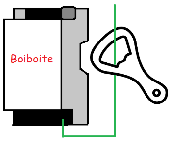
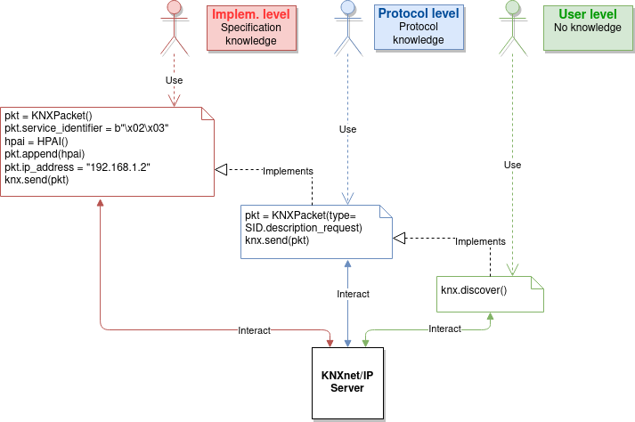
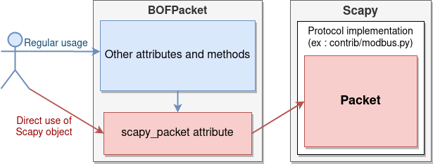

Introduction
============

Overview
--------

BOF (Boiboite Opener Framework) is a testing framework for industrial and field
protocols implementations and devices. It is a Python 3.6+ library that provides
means to send, receive, create, parse and manipulate frames from supported
protocols, for basic interaction as well as for offensive testing.

There are three ways to use BOF:

:Automated: Use of higher-level interaction functions to discover devices and
	    start basic exchanges, without requiring to know anything about the
	    protocol. BOF also has **Modules** that gather these functions.

:Standard: Perform more advanced (legitimate) operations. This requires the end
	   user to know how the protocol works (how to establish connections,
	   what kind of messages to send).

:Playful: Modify every single part of exchanged frames and misuse the protocol
	  instead of using it (we fuzz devices with it). The end user should
	  have started digging into the protocol's specifications.

.. warning:: **Please note that targeting industrial systems can have a severe
   impact on people, industrial operations and buildings and that BOF must be
   used carefully.**

Interface with Scapy
--------------------

BOF relies on Scapy for protocol implementations, with an additional layer that
translates BOF code to changes on Scapy packets and fields. Why? Because BOF may
slightly modify or override Scapy's internal behavior.

**You do not need to know how to use Scapy to use BOF, however if you do, you are
free to interact with the Scapy packet directly as well.**

For instance, in the code sample below, lines 2 and 3 do the same thing and
modify the same packet object. However for line 2, you set a value to the
``field1`` from **BOF**'s packet, applying any change provided by BOF when
setting a value. In line 3, the field is modified directly in **Scapy**'s
packet, BOF does not interfer. In other words, a ``BOFPacket`` object (here
``KNXPacket``) acts as a wrapper around a Scapy object representing the actual
packet using the specified protocol.

.. code-block:: python
   :linenos:

   packet = KNXPacket(type=connect_request)
   packet.field1 = 1
   packet.scapy_pkt.field1 = 1

The reason we did that is because there is nothing better than Scapy to handle
protocol implementations, and by using Scapy we can also use all the
implementations that were written for it. But BOF and Scapy do not have the same
usage and aim. Just to mention a few:

* **Field-oriented usage**: BOF's preferred usage when altering packets is to
   change specific fields directly. Why? Because BOF has been written to write
   attack scripts, including fuzzers. In these fuzzers, we want to stick to the
   protocol's specification because if we don't, devices we target may just drop
   our frames. But we also want to do whatever we want on packets, sticking to
   the specification or not. So what we usually do is to modify isolated fields
   in frames. Scapy does not work this way and, although we can modify fields
   independently, it's hard to get and set values in a script, mostly because we
   can't refer to a field without referring to its parent packet holding its
   value. This also implies that Scapy builds packets as a whole, and performs a
   final computation / cleaning when building the packet before sending it, and
   sometimes we don't want that in BOF.

* **BOF does not care about types**: But Scapy does. Field objects in Scapy have
  a type and you can't change it easily or just use a field object that doesn't
  have a type without losing some capabilities. For us, packets are just a bunch
  of bytes so we might as well set values directly as bytes to fields, and Scapy
  won't allow that (unless using RawVal, which does not provide all of Scapy's
  Fields capabilities). It won't allow setting a value with the wrong type
  either, and we don't want field types to be a thing in BOF: a user should not
  need to know the type of a field, or she may be able to implicitly change
  it. That's what BOF's wrapper around the Scapy object does.

.. code-block:: python

   # Setting value to field from BOF, type is changed automatically
   bofpacket.host_protocol = "test"

   # Setting value to field directly on Scapy packet, type is invalid
   # and will trigger an error when the packet is built.
   bofpacket.scapy_pkt.control_endpoint.host_protocol = "test"

TL;DR
=====

Clone repository::

    git clone https://github.com/Orange-Cyberdefense/bof.git

BOF is a Python 3.6+ library that should be imported in scripts.

.. code-block:: python

   import bof

Global module content can be imported directly from ``bof``. Protocol-specific
content is in submodule ``layers`` (ex: ``bof.layers.knx``).

.. code-block:: python

   from bof import BOFProgrammingError
   from bof.layers import knx
   from bof.layers.knx import *
   from bof.modules import discovery

Now you can start using BOF!

.. note:: Examples in this section rely on the protocol KNX, but also apply to
	  the others. Please refer to the **Protocols** section of this
	  documentation for protocol-specific stuff.

Several ways to discover devices on a network
---------------------------------------------

Targeted discovery from the discovery module
++++++++++++++++++++++++++++++++++++++++++++

.. code-block:: python

   from bof.modules.discovery import *

   devices = targeted_discovery(iface="eth0", verbose=True)

Device discovery using a layer's high-level function
++++++++++++++++++++++++++++++++++++++++++++++++++++
   
.. code-block:: python

   from bof.layers.knx import search

   devices = search()
   for device in devices:
       print(device)

Should output something like::

  [KNX] Device name: boiboite
	Description: None
	MAC address: 00:00:ff:ff:ff:ff
	IP address: 192.168.1.242
	Port: 3671
	Multicast address: 224.0.23.12
	KNX address: 1.1.1
	Serial number: 0123456789

Create and send your own discovery packet
+++++++++++++++++++++++++++++++++++++++++

.. code-block:: python

   from bof.layers.knx import *

   pkt = KNXPacket(type="search request")
   responses = KNXnet.multicast(pkt, (KNX_MULTICAST_ADDR, KNX_PORT))
   for response, _ in responses:
       print(KNXPacket(response))

Send and receive packets
------------------------

.. code-block:: python

   from bof.layers.knx import KNXnet, KNXPacket, SID
   from bof import BOFNetworkError

   try:
       knxnet = KNXnet().connect("192.168.1.242", 3671)
       pkt = KNXPacket(type=SID.description_request,
                       ip_address=knxnet.source_address,
                       port=knxnet.source_port)
       pkt.show2()
       response, _ = knxnet.sr(pkt)
       response.show2()
   except BOFNetworkError as bne:
       pass
   finally:
       knxnet.disconnect()

Craft your own packets!
-----------------------

.. code-block:: python

   from bof.layers.knx import KNXPacket, SID
   from bof.layers.raw_scapy.knx import LcEMI

   pkt = KNXPacket(type=SID.description_request)
   pkt.ip_address = b"\x01\x01"
   pkt.port = 99999 # Yes it's too large
   pkt.append(LcEMI())
   pkt.show2() # This may output something strange

.. note:: A recipient device will probably not respond to that, but at least
	  now you know that BOF won't stop you from messing with your packets.

Basic fuzzing
-------------

All ``BOFPacket`` inheriting packet objects in protocol (e.g. ``KNXPacket``)
implement a ``fuzz()`` method.

.. code-block:: python

   for pkt in KNXPacket(type="configuration request").fuzz():
       knxnet.send(pkt)

The method generates packets mutated from the original frame. For each packet,
one random field has a random value set. This may not work with all fields
depending on their type, and you may also want some fields to remain unchanged.
In this case, the ``include`` or ``exclude`` arguments can be used.

.. code-block:: python

   for pkt in base_pkt.fuzz(exclude=("service_identifier")):
       knxnet.send(pkt)

----------------------

Usage
=====

Getting started with BOF Packets
--------------------------------

.. important:: This section introduces a few general concepts about packet
	       crafting in BOF but does not tell you how to create and
	       manipulate packets with specific protocols. As there may be
	       differences depending on the protocol, please refer to the
	       **Protocols** section for details. Please note that not all
	       layers existing in BOF implement a BOFPacket object.

Protocol-dependent packets you may manipulate in BOF all inherit from
``BOFPacket``. For instance, ``KNXPacket`` is the BOF packet from the protocol
KNX. ``BOFPacket`` is not supposed to be instantiated directly, however it can
be useful when you start interacting with unknown/unimplemented protocols.

You can instantiate a packet inheriting from ``BOFPacket`` as follows::

  bof_pkt = KNXPacket() # Empty
  bof_pkt = KNXPacket(b"\x06\x10"[...]) # From bytes
  bof_pkt = KNXPacket(field1=val, field1=val2, etc...) # Set values to fields

For ``KNX``, packets usually have a ``type``, therefore you could do::

  bof_pkt = KNXPacket(type=SID.description_request)

Before going further, you should know that a ``BOFPacket`` relies on a protocol
implementation from Scapy or in Scapy format and will interact with a Scapy
``Packet`` object relying on this implementation. This implies that:

* There are several features, mostly for printing the content of a frame,
  inherited from Scapy.
* We have to make a clear distinction between BOF and Scapy content, especially
  when setting values to fields, hence some usage choices detailed later.
* You can directly use Scapy features, if you interact with ``BOFPacket`` 's
  ``scapy_pkt`` attribute.

View packets and fields
-----------------------

Here is how to read a complete packet:

.. code-block:: python

   >>> print(packet)
   b'\x06\x10\x02\x03\x00\x0e\x08\x01\x00\x00\x00\x00\x00\x00'

   >>> packet.show2()
   ###[ KNXnet/IP ]### 
   header_length= 6
   protocol_version= 0x10
   service_identifier= DESCRIPTION_REQUEST
   total_length= 14
   ###[ DESCRIPTION_REQUEST ]### 
        \control_endpoint\
         |###[ HPAI ]### 
         |  structure_length= 8
         |  host_protocol= IPV4_UDP
         |  ip_address= 0.0.0.0
         |  port      = 0

And to read the value of a field (for instance, ``host_protocol``, which is
located in the ``control_endpoint`` PacketField):

.. code-block:: python

   # Direct access from BOF packet
   >>> packet.host_protocol
   1

   # Reading bytes from BOF packet
   >>> packet["host_protocol"]
   b'\x01'

   # Using BOF packet method get() with no path
   >>> packet.get("host_protocol")
   1

   # Using get() method with absolute or partial path
   >>> packet.get("control_endpoint", "host_protocol")
   1

   # Browsing to Scapy field directly from scapy_pkt attribute
   >>> packet.scapy_pkt.control_endpoint.host_protocol
   1

There are a few things to consider when reaching fields for reading and writing
in BOF:

1. ``packet.scapy_pkt.host_protocol`` won't work, because ``scapy_pkt`` does not
   have a ``host_protocol`` field. It has a ``control_endpoint`` field which has
   a ``host_protocol``. The complete (absolute) path is required when accessing
   fields via ``scapy_pkt`` and not via BOF directly.

2. ``packet.control_endpoint.host_protocol`` won't work either. If you access
   fields from BOF, only direct access is allowed (``packet.host_protocol``).
   This is mainly to avoid confusions between BOF syntax and Scapy syntax (see
   below). If there are two fields with the same name but different paths in the
   packet, this syntax will refer to the first one. To refer to a specific one,
   use ``packet.get()``

Modify packets and fields
-------------------------

BOF does not only set values to packets and fields, it may change Scapy's
default behavior when changing the Scapy Packet underneath. The main change is
that BOF will replace the field by a field with another type if the value we are
trying to set does not match the actual type.

.. code-block:: python

   >>> type(packet._get_field("host_protocol")[0])
   <class 'scapy.fields.ByteEnumField'>
   >>> packet.host_protocol = b"hey"
   >>> type(packet._get_field("host_protocol")[0])
   <class 'scapy.fields.Field'>

Therefore, there are two ways of setting a value in BOF.

* The BOF way:

.. code-block:: python

   >>> packet.host_protocol = b"cor"
   >>> packet.host_protocol
   b'cor'
   >>> packet.update(b"ne", "host_protocol")
   >>> packet.host_protocol
   b'ne'
   >>> packet.update(b"muse", "control_endpoint", "host_protocol")
   >>> packet.host_protocol
   b'muse'

* The Scapy way:

   >>> packet2.scapy_pkt.control_endpoint.host_protocol = b"nope"

**The BOF way** will set the value while applying changes specific to BOF (ex:
replacing a field with a field with a different type). The Packet remains valid
(and readable by Scapy's internal features) even if we set the wrong type to a
field.

**The Scapy way** will directly change the value of the Scapy field, BOF will
not interfer and will not apply BOF-specific changes. In this last example, we
set a value of the wrong type to the field, and an exception will be triggered
if you call a method that will try to reconstruct the packet (such as
``show2()`` or ``raw()``).

Network connection
------------------

BOF provides core class for TCP and UDP network connections, however they should
not be used directly, but inherited in protocol implementation network
connection classes (ex: ``KNXnet`` inherits ``UDP``). A connection class carries
information about a network connection and methods to manage connection and
exchanges, that can vary depending on the protocol.

Here is an example on how to establish connection using the ``knx`` submodule
(``3671`` is the default port for KNXnet/IP).

.. code-block:: python

   from bof.layers.knx import KNXnet, KNXPacket, SID
   from bof import BOFNetworkError

   knxnet = KNXnet()
   try:
       knxnet.connect("192.168.1.242", 3671)
       pkt = KNXPacket(type=SID.description_request,
                       ip_address=knxnet.source_address,
                       port=knxnet.source_port)
       pkt.show2()
       response, _ = knxnet.sr(pkt)
       response.show2()
   except BOFNetworkError as bne:
       pass
   finally:
       knxnet.disconnect()

There are also various ntework-related functions to use directly. For instance,
to send requests via multicast:

.. code-block:: python

   responses = KNXnet.multicast(pkt, (KNX_MULTICAST_ADDR, KNX_PORT))
       
Error handling and logging
--------------------------

BOF has custom exceptions inheriting from a global custom exception class
``BOFError`` (code in `bof/base.py`):

:BOFLibraryError: Library, files and import-related exceptions.
:BOFNetworkError: Network-related exceptions (connection errors, etc.).
:BOFProgrammingError: Misuse of the framework (most frequent one)

.. code-block:: python

   try:
       knx.connect("invalid", 3671)
   except BOFNetworkError as bne:
       print("Connection failure: ".format(str(bne)))

   try:
      pkt.KNXPacket(type=SID.configuration_request)
      pkt.update("unknown", 4)
   except BOFProgrammingError:
      print("Field does not exist.")     

Logging features can be enabled for the entire framework. They are disabled by
default. Events are stored to a file (default name is ``bof.log``). One can make
direct call to bof's logger to record custom events.

.. code-block:: python

    bof.enable_logging()
    bof.log("Cannot send data to {0}:{1}".format(ip, port), level="ERROR")
