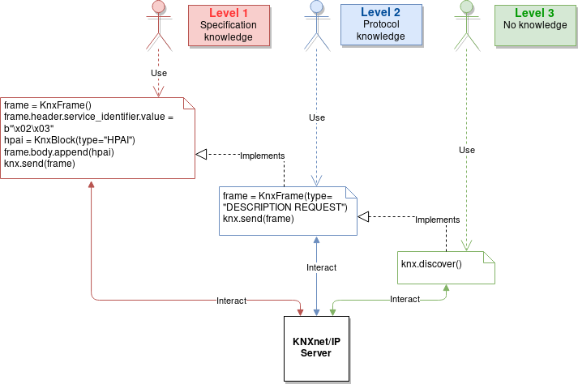
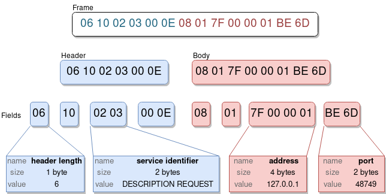

User manual
===========

Overview
--------

BOF (Boiboite Opener Framework) is a testing framework for field protocols
implementations and devices. It is a Python 3.6+ library that provides means to
send, receive, create, parse and manipulate frames from supported protocols.

The library currently supports **KNXnet/IP**, which is our focus, but it can be
extended to other types of BMS or industrial network protocols.

There are three ways to use BOF:

* Automated: Use of higher-level interaction functions to discover devices and
  start basic exchanges, without requiring to know anything about the protocol.

* Standard: Perform more advanced (legitimate) operations. This requires the end
  user to know how the protocol works (how to establish connections, what kind
  of messages to send).

* Playful: Modify every single part of exchanged frames and misuse the protocol
  instead of using it (we fuzz devices with it). The end user should have
  started digging into the protocol's specifications.

**Please note that targeting BMS systems can have a severe impact on buildings and
people and that BOF must be used carefully.**

TL;DR
-----

Clone repository::

    git clone https://github.com/Orange-Cyberdefense/bof.git

BOF is a Python 3.6+ library that should be imported in scripts.  It has no
installer yet so you need to refer to the `bof` subdirectory which contains the
library (inside the repository) in your project or to copy the folder to your
project's folder. Then, inside your code (or interactively):

.. code-block:: python

   import bof

Now you can start using BOF!

The following code samples interact using the building management system
protocol KNXnet/IP (the framework supports only this one for now).

Discover devices on a network
+++++++++++++++++++++++++++++

The function `search()` from `bof.knx` lists the IP addresses of KNX devices
responding on an IP network.

>>> from bof import knx
>>> knx.search("192.168.1.0/24")
['192.168.1.10']

The function `discover()` gathers information about a KNX device at a defined IP
address (or on multiple KNX devices on an address range) and stores it to a
``KnxDevice`` object.

>>> from bof import knx
>>> device = knx.discover("192.168.1.10")
>>> print(device)
KnxDevice: Name=boiboite, MAC=00:00:54:ff:ff:ff, IP=192.168.1.10:3671 KNX=15/15/255

Send and receive packets
++++++++++++++++++++++++

.. code-block:: python

   from bof import knx, BOFNetworkError

   knxnet = knx.KnxNet()
   try:
       knxnet.connect("192.168.1.1", 3671)
       frame = knx.KnxFrame(type="DESCRIPTION REQUEST")
       print(frame)
       knxnet.send(frame)
       response = knxnet.receive()
       print(response)
   except BOFNetworkError as bne:
       print(str(bne))
   finally:
       knxnet.disconnect()

Craft your own packets!
+++++++++++++++++++++++

.. code-block:: python

   from bof import knx

   frame = knx.KnxFrame()
   frame.header.service_identifier.value = b"\x02\x03"
   hpai = knx.KnxBlock(type="HPAI")
   frame.body.append(hpai)
   print(frame)

----------------------

Basics
------

Structure and imports
+++++++++++++++++++++

.. code-block:: python

    import bof
    from bof import byte
    from bof import knx
    from bof import knx, BOFNetworkError

Global module content can be imported directly from ``bof``. Protocol-specific
content is in specific submodules (ex: ``bof.knx``).

The library has the following structure::

   ../bof
   ├── base.py
   ├── byte.py
   ├── __init__.py
   ├── knx
   │   ├── __init__.py
   │   ├── knxdevice.py
   │   ├── knxframe.py
   │   ├── knxnet.json
   │   └── knxnet.py
   └── network.py

Error handling and logging
++++++++++++++++++++++++++

BOF has custom exceptions inheriting from a global custom exception class
``BOFError`` (code in `bof/base.py`):

:BOFLibraryError: Library, files and import-related exceptions.
:BOFNetworkError: Network-related exceptions (connection errors, etc.).
:BOFProgrammingError: Misuse of the framework.

.. code-block:: python

   try:
       knx.connect("invalid", 3671)
   except bof.BOFNetworkError as bne:
       print("Connection failure: ".format(str(bne)))

Logging features can be enabled for the entire framework. Global events will be
stored to a file (default name is ``bof.log``). One can make direct call to
bof's logger to record custom events.

.. code-block:: python

    bof.enable_logging()
    bof.log("Cannot send data to {0}:{1}".format(address[0], address[1]), level="ERROR")

Other useful stuff
++++++++++++++++++

The framework comes with some useful functions used within the library but that can
be used in scripts as well. Refer to source code documentation for details.

:Byte conversion: `bof/byte.py` contains functions for byte resize and
		  conversion to/from int, string, ipv4, bit list.

.. code-block:: python

   x = bof.byte.from_int(1234)
   x = bof.byte.resize(x, 1) # Truncates

Network connection
------------------

So far, BOF only supports the KNXnet/IP protocol (using KNX field protocol). New
protocols should follow the same pattern. Below, ``3671`` is the default port
for KNXnet/IP.

.. code-block:: python

   knxnet = knx.KnxNet()
   try:
       knxnet.connect("192.168.1.1", 3671)
       knxnet.send(knx.KnxFrame(type="DESCRIPTION REQUEST"))
       response = knxnet.receive()
   except BOFNetworkError as bne:
       print(str(bne))
   finally:
       knxnet.disconnect()

A ``KnxNet`` object carries information about a network connection and method to
manage connection and exchanges.

connect/disconnect
++++++++++++++++++

.. code-block:: python

   connect(self, ip:str, port:int=3671, init:bool=False) -> object
   disconnect(self, in_error:bool=False) -> object

``connect`` takes an additionnal ``init`` parameter. When ``True``, a ``CONNECT
REQUEST`` frame is sent to the remote KNX device to initialize the connection
and a ``DISCONNECT REQUEST`` will be sent automatically when disconnecting. The
``KnxNet`` object stores data associated to the current connection.

When a connection is established and initialized, the following attributes are
set:

:channel: Communication channel ID set by the remote KNX device and given in
	  the ``CONNECT RESPONSE`` frame.

send/receive
++++++++++++

.. code-block:: python

   send(self, data, address:tuple=None) -> int
   receive(self, timeout:float=1.0) -> object
   send_receive(self, data:bytes, address:tuple=None, timeout:float=1.0) ->
   object

``send`` and ``receive`` exchange data with the remote server as byte
arrays. One can directly send a raw byte array or a ``KnxFrame`` object which
will be converted to a byte array. Received frames are parsed into a
``KnxFrame`` object (returned by ``receive``) but can still be accessed as raw
bytes. See next section for more information on ``KnxFrame`` objects.

``send_receive`` is just a merge of send and receive, meaning that
``send_receive()`` is equivalent to ``send() ; receive()``. This is useful for
protocols such as KNX that do TCP stuff over UDP.

Here is how to send and receive frames as ``KnxFrame`` objects (``send`` can
also take a raw byte array instead of a ``KnxFrame`` object). How to build such
object is described in the next section.

.. code-block:: python

   request = knx.KnxFrame(type="DESCRIPTION REQUEST")
   knxnet.send(request)
   response = knxnet.receive()
   print(response) # Response is a KnxFrame object

KNX frames
----------

Frames are sent and received as byte arrays. They can be divided into a set of
blocks, which contain a set of fields of varying sizes. Conforming to the KNX
Standard v2.1, the header's structure never changes and the body's structure
varies according to the type of the frame given in the header's ``service
identifier`` field. For instance, the format of a ``DESCRIPTION REQUEST``
message extracted from the specification has the following content.

In BOF, frames, blocks and fields are represented as objects (classes). A frame
(``KnxFrame``) has a header and a body, both of them being blocks
(``KnxBlock``).  A block contains a set of raw fields (``KnxField``) and/or
nested ``KnxBlock`` objects with a special structure (ex: ``HPAI`` is a type of
block with fixed fields).  Finally, a ``KnxField`` object has three main
attributes: a ``name``, a ``size`` (number of bytes) and a ``value`` (as a byte
array). 

Create frames
+++++++++++++

Within a script using BOF, a ``KnxFrame`` can be built either from scratch
(creating each block and field one by one), from a raw byte array that is parsed
(usually a received frame) or by specifying the type of the frame in the
constructor.

.. code-block:: python

   empty_frame = knx.KnxFrame()
   existing_frame = knx.KnxFrame(type="DESCRIPTION REQUEST")
   received_frame = knx.KnxFrame(frame=data, source=address)

From the specification
""""""""""""""""""""""

The KNX standard describes a set of message types with different format. They
are described in BOF in a JSON specification file, containing the definition of
message codes, block types and frame structures. The KNX Standard has not been
fully implemented yet so there may be missing content, please refer to
`bof/knx/knxnet.json` to know what is currently supported. Obviously, the
specification file content can be changed or a frame can be built without
referring to the specification, we discuss it further in the "Advanced
usage" section (not available yet).

.. code-block:: python

   frame = knx.KnxFrame(type="DESCRIPTION REQUEST")

A ``KnxFrame`` object based on a frame with the ``DESCRIPTION REQUEST`` service
identifier (sid) will be built according to this portion of the `knxnet.json`
specification file.

.. code-block:: json

   {
    "service identifiers": {
	"DESCRIPTION REQUEST": {"id": "0203"}
   },
   "bodies": {
	"DESCRIPTION REQUEST": [
	    {"name": "control endpoint", "type": "HPAI"}
	]
   },
   "blocktypes": {
	"HEADER": [
	    {"name": "header length", "type": "field", "size": 1, "is_length": true},
	    {"name": "protocol version", "type": "field", "size": 1, "default": "10"},
	    {"name": "service identifier", "type": "field", "size": 2},
	    {"name": "total length", "type": "field", "size": 2}
	],
	"HPAI": [
	    {"name": "structure length", "type": "field", "size": 1, "is_length": true},
	    {"name": "host protocol code", "type": "field", "size": 1, "default": "01"},
	    {"name": "ip address", "type": "field", "size": 4},
	    {"name": "port", "type": "field", "size": 2}
	]
   }
   }

It should then have the following pattern:

.. figure:: images/bof_spec.png

In predefined frames, fields are empty except for fields with a default value or
fields that store a length, which is evaluated automatically. Some frames can be
sent as is to a remote server, such as ``DESCRIPTION REQUEST`` frames, but some
of them require to fill the empty fields (see `Modify frames`_ below).

From a byte array
"""""""""""""""""

A KnxFrame object can be created by parsing a raw byte array. This is what
happens when receiving a frame from a remote server.x

.. code-block:: python

   frame_from_byte =
   knx.KnxFrame(frame=b'\x06\x10\x02\x03\x00\x0e\x08\x01\x7f\x00\x00\x01\xbe\x6d')
   received_frame = knxnet.receive() # received_frame is a KnxFrame object

The format of the frame must be understood by BOF to be efficient (i.e. the
service identifier shall be recognized and described in the JSON specification
file).

From scratch
""""""""""""

A frame can be created without referring to a predefined format, by manually
adding blocks and fields to the frame. The section "Advanced usage" (not
available yet) contains details on how to do so.

.. code-block::

   frame = knx.KnxFrame()
   frame.header.service_identifier.value = b"\x02\x03"
   hpai = knx.KnxBlock(type="HPAI")
   frame.body.append(hpai)
   print(frame)

Read frames
+++++++++++

There are several ways to gather information about a frame:

.. code-block:: python

   >>> bytes(frame)
   b'\x06\x10\x02\x03\x00\x0e\x08\x01\x7f\x00\x00\x01\xbe\x6d'

   >>> print(frame) 
   KnxFrame object: <bof.knx.knxframe.KnxFrame object at 0x7fb810f799b0>
   [HEADER]
       <header length: b'\x06' (1B)>
       <protocol version: b'\x10' (1B)>
       <service identifier: b'\x02\x03' (2B)>
       <total length: b'\x00\x0e' (2B)>
   [BODY]
       KnxBlock: control endpoint
           <structure length: b'\x08' (1B)>
           <host protocol code: b'\x01' (1B)>
           <ip address: b'\x00\x00\x00\x00' (4B)>
           <port: b'\x00\x00' (2B)>

   >>> print(frame.sid)
   DESCRIPTION REQUEST

   >>> print(frame.attributes)
   ['header_length', 'protocol_version', 'service_identifier', 'total_length',
   'control_endpoint', 'structure_length', 'host_protocol_code', 'ip_address',
   'port']

The content of a frame is a set of blocks and fields. The ordered list of fields
object (even fields in blocks and blocks within blocks) can be accessed as
follows:

.. code-block:: python

   >>> for field in frame:
   ...     print(field)
   ... 
   <header length: b'\x06' (1B)>
   <protocol version: b'\x10' (1B)>
   <service identifier: b'\x02\x03' (2B)>
   <total length: b'\x00\x0e' (2B)>
   <structure length: b'\x08' (1B)>
   <host protocol code: b'\x01' (1B)>
   <ip address: b'\x00\x00\x00\x00' (4B)>
   <port: b'\x00\x00' (2B)>

   >>> print(frame.fields)
   [<bof.knx.knxframe.KnxField object at 0x7f384a931cc0>,
   <bof.knx.knxframe.KnxField object at 0x7f384a931c88>, <bof.knx.knxframe.KnxField
   object at 0x7f384a1ddfd0>, <bof.knx.knxframe.KnxField object at 0x7f384a1ddf60>,
   <bof.knx.knxframe.KnxField object at 0x7f3844e7b438>, <bof.knx.knxframe.KnxField
   object at 0x7f3844e7b470>, <bof.knx.knxframe.KnxField object at 0x7f3844e7b4a8>,
   <bof.knx.knxframe.KnxField object at 0x7f3844e7b4e0>]

Finally, one can access specific part of a frame by name (part of the structure,
block, field) and access its properties.

.. code-block:: python

   >>> print(frame.header)
   KnxBlock: header
       <header length: b'\x06' (1B)>
       <protocol version: b'\x10' (1B)>
       <service identifier: b'\x02\x03' (2B)>
       <total length: b'\x00\x0e' (2B)>

   >>> print(frame.header.total_length)
   <total length: b'\x00\x0e' (2B)>

   >>> print(frame.header.total_length.name)
   total length

   >>> print(frame.header.total_length.value)
   b'\x00\x0e'

   >>> print(frame.header.total_length.size)
   2

Modify frames
+++++++++++++

Say we want to create a ``CONNECT REQUEST`` frame. Using the two previous
sections, here is how to do it.

We first need information associated to the current connection (source ip and
port, stored within a ``KnxNet`` object after the UDP connection is
established).

.. code-block:: python

   ip, port = knxnet.source

We have to create the predefined frame with the appropriate format (blocks and
fields), but some of them are empty (values set to 0). We then have to fill some
of them that are required to be understood by the server.

.. code-block:: python

   connectreq = knx.KnxFrame(type="CONNECT REQUEST")

   connectreq.body.control_endpoint.ip_address.value = ip
   connectreq.body.control_endpoint.port.value = port
   connectreq.body.data_endpoint.ip_address.value = ip
   connectreq.body.data_endpoint.port.value = port

Finally, we need to specify the type of connection we want to establish with the
server. The latter is sent as an identifier in the field
``connection_type_code``.  The list of existing identifiers for this field are
defined in the KNX standard and reported to the JSON specification
file. Therefore, we can either set the ID manually, or refer to the
specification file. The content of the specification file can be accessed by
instantiating the singleton class ``KnxSpec``. From this object, the sections in
the JSON file can be accessed as properties (details in "Advanced Usage" (not
available yet)).

.. code-block::

   knxspecs = knx.KnxSpec()
   connection_type = knxspecs.connection_types["Device Management Connection"]
   connectreq.body.connection_request_information.connection_type_code.value = connection_type
